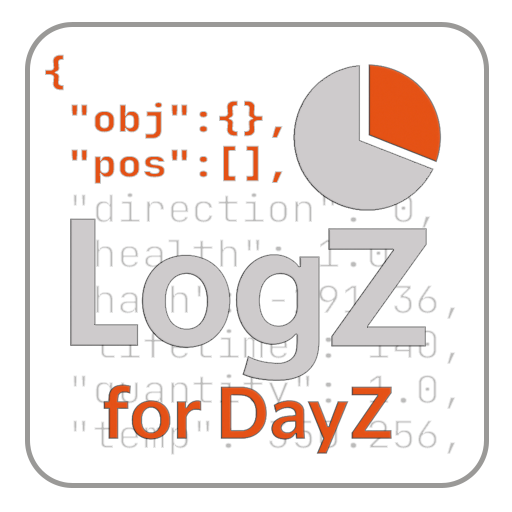

# LogZ

<!-- markdownlint-disable-next-line MD033 -->


LogZ is a server-side modification for DayZ that implements structured
logging in NDJSON (Newline Delimited JSON) format.

The mod is designed to send server logs to ELK, Loki, Graylog, or
VictoriaLogs. It brings DevOps Best Practices into the DayZ environment.

Unlike standard text logs (`.log`, `.ADM`), which are impossible to parse
automatically, LogZ creates machine-readable events with a fixed structure.
This allows you to build dashboards, configure alerts, and quickly search
for information.

This logger is not about errors and exceptions; it is about server
statistics and analytics. The main goals are not to spam with noisy events
but to provide server administrators with the most important and useful data
to study player activity and behavior.

> [!WARNING]  
> **BETA VERSION**
>
> This mod is currently in **BETA**.
>
> * The log structure, configuration schema, internal API,
>   and file paths **are subject to change** without backward compatibility.
> * It is **not recommended for use in production environments**
>   where data stability is critical.
> * Please check the changelogs carefully when updating.

<!-- markdownlint-disable-next-line MD033 -->
<br clear="right"/>

> [!TIP]  
> It works best when combined with Prometheus-format metrics using the
> [MetricZ] mod. MetricZ accumulates updatable metrics in counters, while
> everything that cannot be ticked as a simple counter is written to the
> structured log.

## Features

* **NDJSON Format:** Each line is a valid JSON object.
* **Rich Context:** Logs not just "who killed whom", but positions,
  inventory, distance, projectile type, hit zones, and much more.
* **Event Coverage:**
  * Player: Connection, chat, suicide, unconsciousness, actions (gestures,
    swimming).
  * Combat: Damage and kills (players, infected, animals).
  * Transport: Damage, destruction, driver/passengers.
  * Building & Items: Interaction, base damage.
  * Inventory: Pickup, drop, item movement (with filtering).
  * System events: Triggers, contamination areas, explosions.
* **Log Rotation:** Built-in file rotation system to prevent disk overflow.
* **Performance:** Throttling of frequent events (e.g., shooting) and damage
  thresholds to reduce spam.

> [!NOTE]  
> The mod is currently under active development.  
> The log structure, API, methods, and DTOs are subject to change.
> For this reason, I am not publishing ready-made dashboards yet.

## Installation

1. Install the mod on the server. Subscribe via Workshop or download the PBO
   from releases. A key is not required for a server-side mod!
1. Add `-servermod=@LogZ` to the server launch parameters.
1. Start the server.
1. The configuration file will be automatically created at
   `$profile:logz/config.json`.
1. Logs will be written to `$profile:logz/logs/`.

## Configuration

Configuration is handled via a JSON file located at `$profile:logz/config.json`.
Changes require a server restart to take effect.

See [CONFIG.md](./CONFIG.md) for a detailed description of all parameters.

## Output Examples

Example of a simple event (connection):

```json
{"ts":1763850873,"uptime_ms":65049,"world_time":1600603200,"instance":99,"level":"info","schema":"logz-v1beta","world":"chernarusplus","event_type":"player.session","msg":"player connected","object":{"name":"SurvivorM_Elias","type":"player","pos":[2011.5880126953126,105.49319458007813,3314.195068359375],"yaw":-52,"health":1.0,"blood":1.0,"shock":1.0,"id":-2065192875,"player_name":"WoozyMasta","steam_id":"76561198037610867"}}
```

The same example formatted:

```json
{
  "ts": 1763850873,
  "uptime_ms": 65049,
  "world_time": 1600603200,
  "instance": 99,
  "level": "info",
  "schema": "logz-v1beta",
  "world": "chernarusplus",
  "event_type": "player.session",
  "msg": "player connected",
  "object": {
    "name": "SurvivorM_Elias",
    "type": "player",
    "pos": [
      2011.5880126953126,
      105.49319458007813,
      3314.195068359375
    ],
    "yaw": -52,
    "health": 1.0,
    "blood": 1.0,
    "shock": 1.0,
    "id": -2065192875,
    "player_name": "WoozyMasta",
    "steam_id": "76561198037610867"
  }
}
```

## Log Collection & Labels

LogZ outputs NDJSON, which is natively supported by most log collectors.  
When configuring your collector, you should extract specific fields
from the root DTO to use as indexed labels (or tags).

Recommended Labels (Low Cardinality):

* `instance`: Server ID (essential for multi-server setups).
* `world`: Map name (e.g., `chernarusplus`).
* `level`: Severity (`info`, `warn`, `error`, etc.).
* `event_type`: The specific event category
  (e.g., `player.kill`, `transport.hit`).

Always map the `ts` field (Unix epoch seconds) to the log timestamp to
ensure accurate timing in your backend.

### Promtail (Loki) Example

```yaml
scrape_configs:
  - job_name: dayz_logz
    static_configs:
      - targets:
          - localhost
        labels:
          job: dayz_logz
          __path__: .../dayz-server/profiles/logz.ndjson
    pipeline_stages:
      - json:
          expressions:
            ts: ts
            level: level
            instance: instance
            world: world
            event_type: event_type
      - labels:
          level:
          instance:
          world:
          event_type:
      - timestamp:
          source: ts
          format: Unix
```

### Fluent Bit Example

```ini
[INPUT]
  Name     tail
  Path     .../dayz-server/profiles/logz.ndjson
  Parser   json
  Tag      dayz.logz

[FILTER]
  Name         parser
  Match        dayz.logz
  Key_Name     log
  Parser       json
  Reserve_Data On

[OUTPUT]
  Name    es
  Match   dayz.logz
  # ... your elastic/loki config ...
  # Ensure 'ts' is mapped to Time_Key if needed
```

## Technical Details (and a bit of pain)

DayZ uses Enforce Script, and the built-in `JsonSerializer` has fatal flaws:
it lacks polymorphism support and cannot exclude empty fields (`omitempty`).

Therefore, **LogZ** uses a hybrid approach:

1. There is a root DTO containing basic fields (`ts`, `level`, `msg`).
2. All additional data (`object`, `victim`, `attacker`, `stats`) are
   serialized separately into JSON strings from various prepared DTOs.
3. The final string is assembled by concatenating additional data and
   inserting it into the root DTO.

This is a "crutch" (workaround), but it is necessary to obtain valid, flat,
and readable JSON without nested escaped strings, which log collectors like
FluentBit or PromTail can easily digest.

## Mod Support

The mod has built-in support for popular modifications:

* **[DayZ-Expansion-AI]**:
  Correctly identifies eAI bots. Damage events on them are logged as
  `CREATURE_HIT`/`KILL` instead of `PLAYER_HIT` to avoid spoiling live
  player statistics.
* **[MetricZ]**:
  Exports Prometheus metrics about the logger's operation:
  * `dayz_metricz_logz_processing_seconds_total` — time spent processing
    logs.
  * `dayz_metricz_logz_events_total` — event counter by levels (Info,
    Warn, Error, etc.).

## For Developers

If you want to use the LogZ API in your mod to send custom events, check out
[INTEGRATION.md](./INTEGRATION.md).

Call example:

```c
LogZ.Info("Custom event message", LogZ_Event.SYSTEM_MISSION);
```

## 👉 [Support Me](https://gist.github.com/WoozyMasta/7b0cabb538236b7307002c1fbc2d94ea)

If this mod saved you hours of analytics or helped catch a cheater or abuser,
please consider supporting me.  
At the very least, a Like and Subscribe on the [LogZ] Steam Workshop
page would be greatly appreciated!

<!-- Links --->
[LogZ]: https://steamcommunity.com/sharedfiles/filedetails/?id=3610709966
[MetricZ]: https://steamcommunity.com/sharedfiles/filedetails/?id=3594119002
[DayZ-Expansion-AI]: https://steamcommunity.com/sharedfiles/filedetails/?id=2792982069
